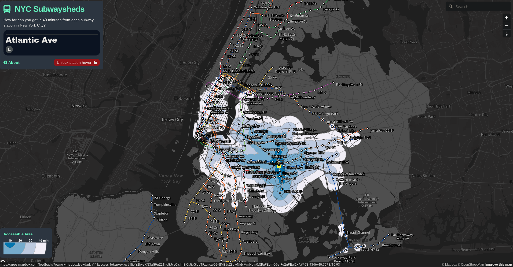

# nyc-subway-isochrones-R-GTFS

# 🚀 Scripts (nodejs and R) for generating travel time isochrones from stations in the New York City subway. 🚀

https://github.com/coding-to-music/nyc-subway-isochrones-R-GTFS

https://subwaysheds.com/#10.93/40.7078/-73.9346

From / By https://github.com/chriswhong/nyc-subway-isochrones

## Environment variables:

```java

```

## user interfaces:

https://subwaysheds.com/#10.93/40.7078/-73.9346

## GitHub

```java
git init
git add .
git remote remove origin
git commit -m "first commit"
git branch -M main
git remote add origin git@github.com:coding-to-music/nyc-subway-isochrones-R-GTFS.git
git push -u origin main
```

## Image of the map via https://subwaysheds.com/stop/l24/atlantic-av



# nyc-subway-isochrones

Scripts (nodejs and R) for generating travel time isochrones from stations in the New York City subway.

## Workflow

1. Start with the [NYC Subway static GTFS file](http://web.mta.info/developers/developer-data-terms.html#data)

`data/google_transit.zip` (unzipped to `data/google_transit`)

2. Run `Rscript caclulate-station-times.R`, which outputs a file `{stop_id}.csv` for each stop in the GTFS data. Each output file contains the travel times to each other station in the system for a given `stop_id`.

3. Run `node trip-times-to-isocrhone.js`, which converts each of the travel times CSVs generated in step 2 into a geojson FeatureCollection containing 10, 20, 30, and 40 minute isocrones.

## Isochrone Creation Algorithm

1. For each station in the system, parse `{stop_id}.csv` and group all of the other stations into 10,20,30,40 minutes of travel time. All stops whose travel time is greater than 40 minutes from the origin are ignored.

2. For each travel-time group:

3. Determine the leftover amount of time to reach the maximum for that group. (10 minutes group - 7 minutes travel time = 3 minutes leftover) This is the amount of "walking" that can be done after leaving the train.

4. Translate the walking time by a fixed distance (e.g. 1.2 meters/second)

5. Generate a buffer for each station based on the walking distance.

6. Buffer the previous travel time group by a full 10-minute walk.

7. Dissolve the station buffers from #2 with the previous travel time group walking buffer from #3

8. Clip to the shoreline of NYC (`data/nyc-shoreline-clip-multi.json`)

9. Save as a geojson FeatureCollection in `isochrones/{stop_id}.geojson`

## Other scripts

`stops-to-geojson` - converts stops.txt into a geojson FeatureCollection, or use in mapping.
